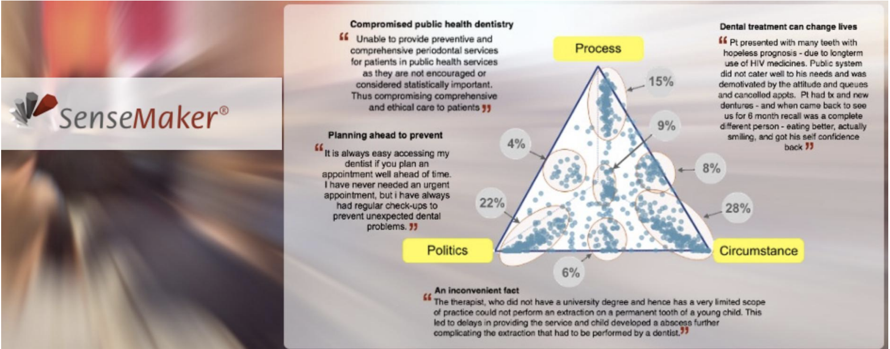

# Screver Hackathon

Screver is a real-time Voice of Employee (VoE) and Voice of Customer (VoC) platform which
empowers with knowledge and insights, combined with flexible expert advisory service.

## Introduction

Hackathon Introduction
For this test project, you will need to use the following Web-App technologies:
- Node.js
- React
- MongoDB App
- Docker

You will develop a simple Sensemaker application, Sensemaker is a survey that includes a
triangle question, where the user drags a “point” on a triangle towards one of the corners to
show his/her preference towards one of the corners.
Example Question:
On what have you spent most time today:

1. Eating
2. Sleeping
3. Working

Then the user would drag the “point” towards one of the corners, if he/she would drag it fully to
the corner sleeping, it would mean he/she has slept all day :)
Sensmaker has more questions for text input and multiple choice but in our hackathon we will
focus only on this one Survey Question that will have one input, one button, one output graphic
and one output list. It will allow the user to select a location on a triangle as input and shows a
heatmap as the output.



You can read about Sensemaker here:

https://thecynefin.co/sensemaker-2/
https://thecynefin.co/about-sensemaker/
https://thecynefin.co/how-to-use-sensemaker/

## Getting Started

First at all, you have to have the knowledge of the following tech stacks:

- [Docker](https://www.docker.com/) as the container service to isolate the environment.
- [Node.js](https://nodejs.org/en/) (Long-Term-Support Version) as the run-time environment to run JavaScript.
- [Express.js](https://expressjs.com/) as the server framework / controller layer
- [MongoDB](https://www.mongodb.com/) as the database layer
- [Mongoose](https://mongoosejs.com/) as the "ODM" / model layer
- [ReactJS](https://reactjs.org/) as the web app layer

## Installation

You will need to first download and install [Docker](https://www.docker.com)

1.  Fork/Clone the repo
2.  Run `docker-compose up` to start three containers:
    - the MongoDB database container
    - the Node.js app container
    - the ReactJS app container
3.  Web app is accessible at `http://localhost` and `http://locahost:8080` for API server.

## Deployment

This is just a Hackathon project. So, we use the GCE to deploy the whole system using docker compose. It means no scale, balancing is configured. Of course, for the real project, it should be deployed to Google Kubernetes Engine service, have autoscale, load balancer with nginx ingress,...We also should setup CI/CD using Jenkins, CircleCI or any others.

### Install docker, docker-compose on GCE
The following bash script will show you how to setup docker, docker compose and git on Google Compute Engine:
```sh
$ sudo apt-get update
$ sudo apt install apt-transport-https ca-certificates curl gnupg2 lsb-release software-properties-common
$ curl -fsSL https://download.docker.com/linux/debian/gpg | sudo apt-key add -
$ sudo add-apt-repository "deb [arch=amd64] https://download.docker.com/linux/debian $(lsb_release -cs) stable"
$ sudo apt update
$ sudo apt install docker-ce
```

Start docker and check status:
```sh
$ sudo systemctl start docker
$ sudo systemctl status docker
$ sudo usermod -aG docker ${USER}
$ docker info
```

Install docker compose
```sh
$ sudo curl -L https://github.com/docker/compose/releases/download/1.25.3/docker-compose-`uname -s`-`uname -m` -o /usr/local/bin/docker-compose
$ sudo chmod +x /usr/local/bin/docker-compose
$ docker-compose --version
```

### Clone git repository
```sh
$ cd /home
$ git clone git@github.com:halay08/survey-testing.git
$ mv survey-testing app
$ cd app
$ docker-compose up -d
```

### Check application status
```
$ docker-compose ps
$ docker-compose logs -f
```

### Let’s Encrypt SSL

```sh
$ sudo apt-get update
$ sudo apt-get install -yq certbot python-certbot-nginx nginx
$ sudo certbot certonly \
  --agree-tos \
  --email ken@kenstack.com \
  --manual \
  --preferred-challenges=dns \
  -d *.screver.kenstack.io \
  --server https://acme-v02.api.letsencrypt.org/directory

$ sudo cp /etc/letsencrypt/live/screver.kenstack.io/fullchain.pem certs/screver.kenstack.io.crt
$ sudo cp /etc/letsencrypt/live/screver.kenstack.io/privkey.pem certs/screver.kenstack.io.key
$ sudo chown -R $USER:$USER certs/
$ docker-compose down && docker-compose up -d
```

## Troubleshooting

Please contact [KenStack Team](dev@kenstack.io) if you have any questions about this Hackathon application.